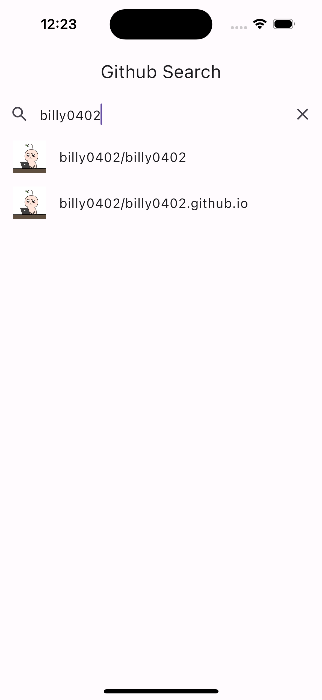
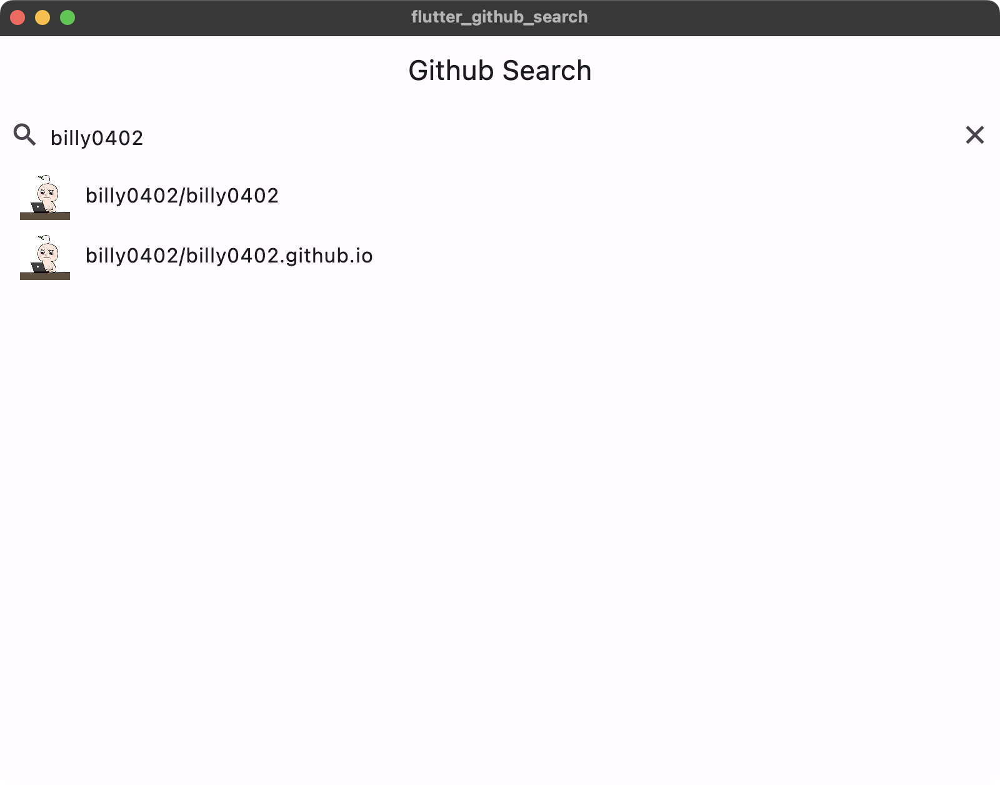
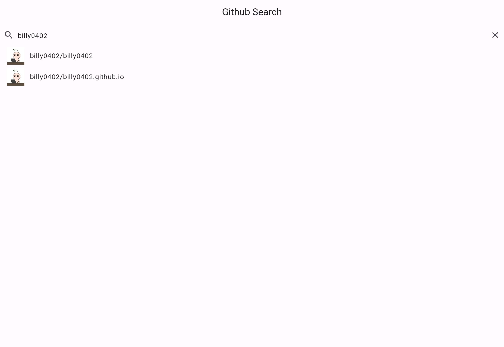
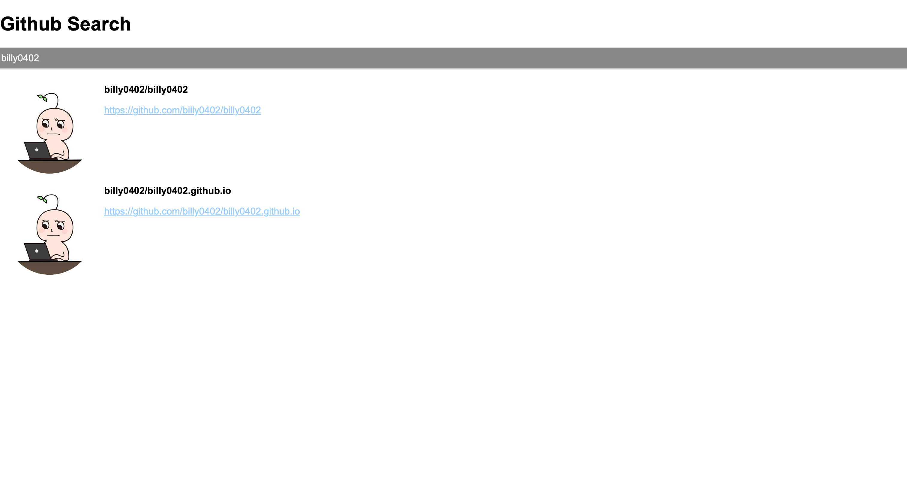

# [flutter-github-search](https://bloclibrary.dev/#/flutterangulargithubsearch)

## environment

- [macOS 13.6.3](https://www.apple.com/tw/macos/ventura/)
- [Android Studio 2022.3.1](https://developer.android.com/studio)
- [Xcode 15.2](https://developer.apple.com/xcode/)
- [Flutter 3.16.8](https://flutter.dev/)
- [Dart 3.2.5](https://dart.dev/)
- iOS emulator iPhone 15 Pro
- Android emulator Pixel 3A (API 34)

## screenshots

### mobile

| platform | screenshot                                        | platform | screenshot                                |
| -------- | ------------------------------------------------- | -------- | ----------------------------------------- |
| Android  |  | iOS      |  |

### desktop & web

| platform     | screenshot                                             |
| ------------ | ------------------------------------------------------ |
| macOS        |           |
| web          |              |
| Angular Dart |  |
